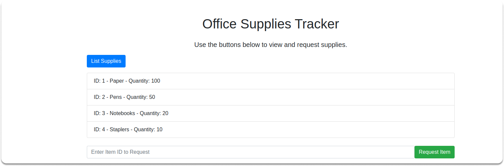

# Office Supplies Tracker

The **Office Supplies Tracker** is a simple Node.js application designed to help manage office inventory and supply requests. It includes a frontend interface and two API endpoints that allow employees to view available office supplies and request items from the inventory.



## Features

- **List Supplies**: View all available office supplies.
- **Request an Item**: Submit a request for an office supply item.

## How It Works

**List Available Supplies**

- Endpoint: `/api/supplies`
- Method: `GET`
- Description: Retrieves a list of all available office supplies.


**Request an Item**

- Endpoint: `/api/supplies/request/:id`
- Method: `POST`
- Description: Allows an employee to request an item by its ID.

### Frontend Interface

The frontend provides a user-friendly interface where employees can:

- **View Inventory**: See a list of all available office supplies.
- **Request Supplies**: Select and request items from the inventory.

## Getting Started

### Prerequisites

- [Node.js and npm](https://nodejs.org/en/download/package-manager) (for local development)
- [Docker](https://docs.docker.com/get-docker/) (optional for containerized deployment)

Confirm that Node.js and npm are installed correctly:

```bash
node -v
npm -v
```

### Running Locally

1. **Clone the Repository**

```bash
git clone https://github.com/colossus06/office-supplies-tracker
cd office-supplies-tracker
```

2. **Install Dependencies**

Ensure that you are in the project directory, then run:

```bash
npm install
```

This command will install all the necessary dependencies listed in the `package.json` file.

3. **Start the Application**

Instead of using `npm start`, you can run the application directly with Node.js:

```bash
node index.js
```

The application will be available at `http://localhost:3000`.

### Running with Docker

1. **Build the Docker Image**

```bash
docker build -t office-supplies-tracker .
```

2. **Run the Docker Container**

```bash
docker run --cap-drop=ALL --cap-add=NET_ADMIN --read-only --security-opt seccomp=./default.json --security-opt apparmor=docker-default -d --name office-supplies-tracker -p 3000:3000 office-supplies-tracker:latest
```

The `default.json` file, which is located in the project directory, contains a [custom Seccomp profile](https://raw.githubusercontent.com/moby/moby/master/profiles/seccomp/default.json) that defines the permitted system calls for the container. 

This profile adds an extra layer of security by limiting the actions that the containerized application can perform. The application will be accessible at `http://localhost:3000`. 
